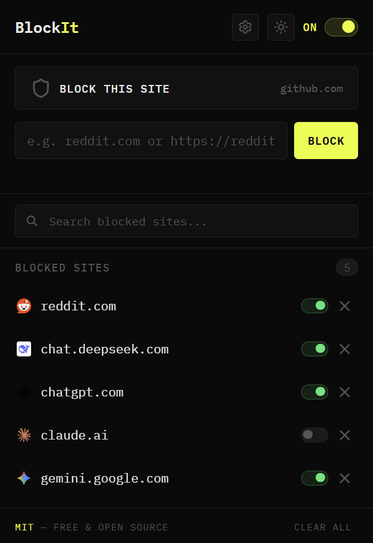
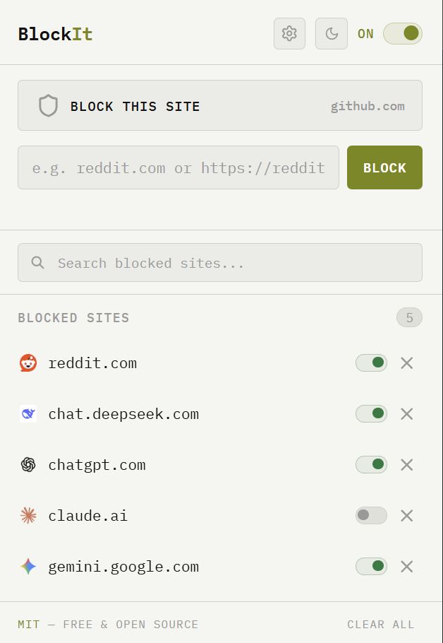
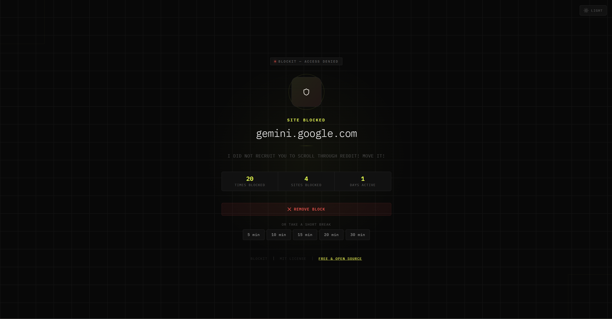
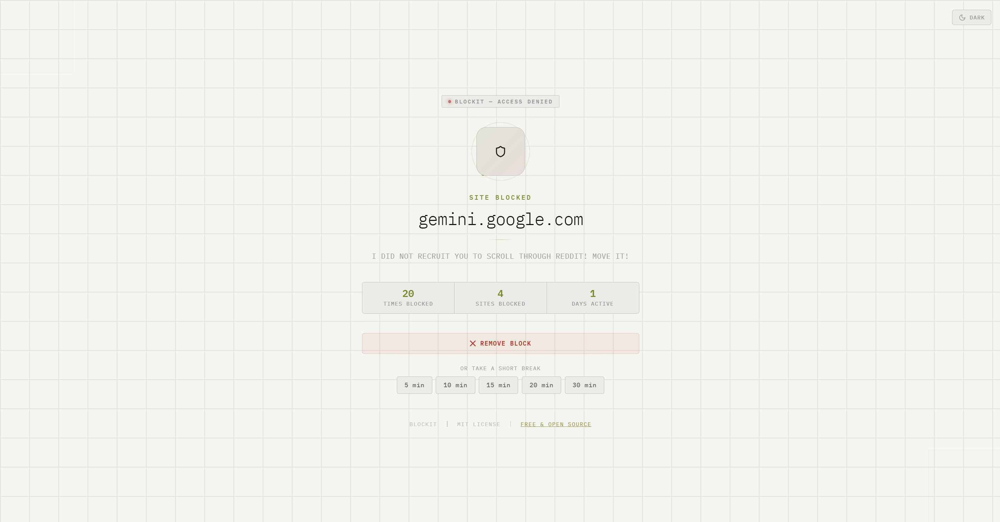

# Blockit — Simple Site Blocker

A minimal, open-source Chrome extension to block distracting websites.  
100% local. No accounts. No cloud. No cost. MIT Licensed.

## Features

- **Block any site**: paste a URL or block the current tab in one click  
- **Per-site toggle**: enable/disable individual sites without deleting them  
- **Global pause**: temporarily disable all blocking with one switch  
- **Instant redirect**: blocked sites redirect to a clean blocked page  
- **Remove from blocked page**: unblock a site directly from the blocked screen
- **Fully local**: all data stored in `chrome.storage.local`, nothing leaves your device

## Screenshots

<div align="center">
  
  
  
  
</div>

## Installation

### From Source (Developer Mode)

1. **Get the Source Code:**

    - Clone this repository via your terminal:
        ```bash
        git clone https://github.com/Abdulaziz-hu/Blockit.git
        ```

    - *Or* download the latest source code ZIP from the [Releases page](https://github.com/Abdulaziz-hu/Blockit/releases/latest) and unzip it.

2. **Open Extensions:**

    - Open Chrome and navigate to `chrome://extensions`.

3. **Enable Developer Mode:**

    - Toggle the **Developer mode** switch in the top-right corner.

4. **Load the Extension:**

    - Click **Load unpacked**.

    - Select the unzipped `Blockit-Extension` folder.

5. **Success:**

    - The BlockIt icon will appear in your browser toolbar.


## How It Works

Blocked sites are stored in `chrome.storage.local` as a simple JSON array. When you add, remove, or toggle a site, the extension syncs the dynamic rules with Chrome's network request engine.

## License

MIT LICENSE. See [LICENSE](LICENSE) file for more details.